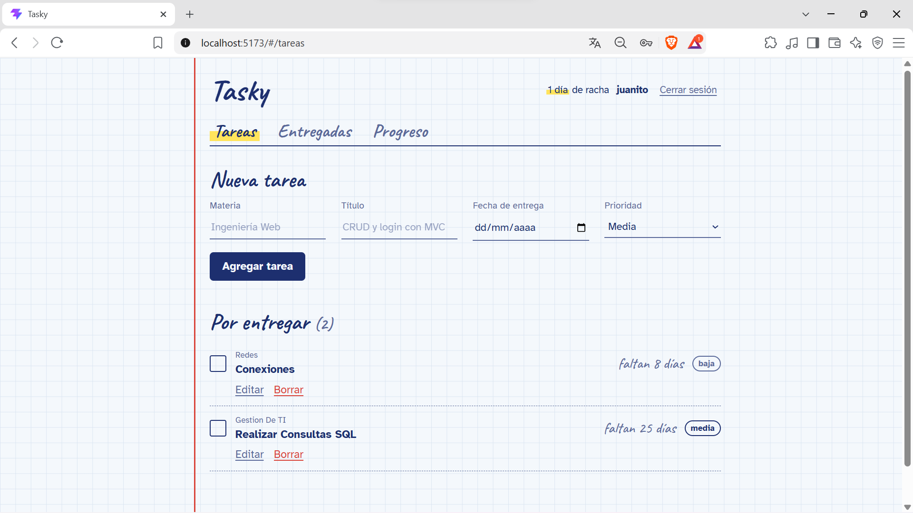
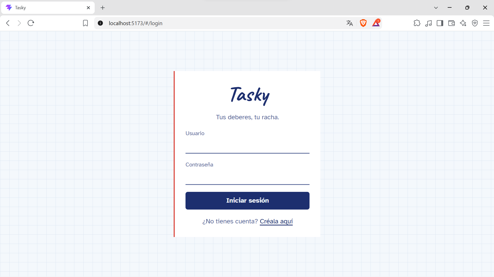
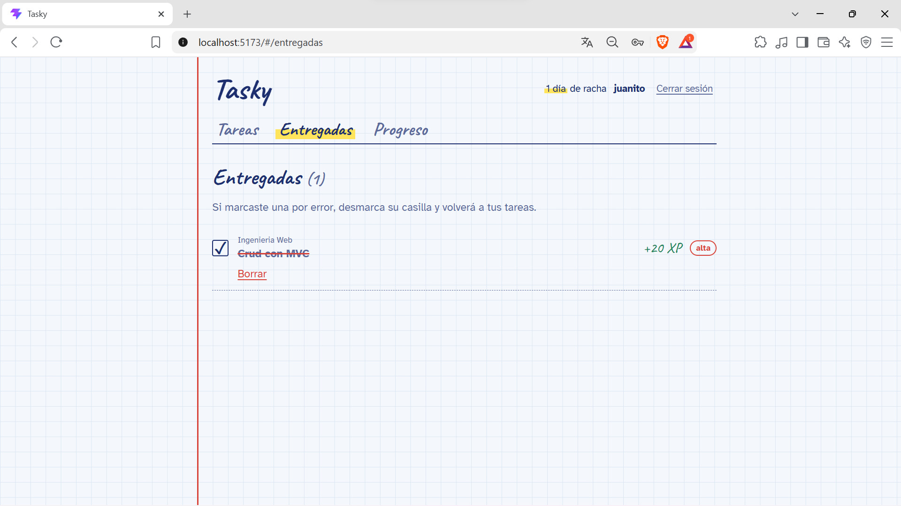
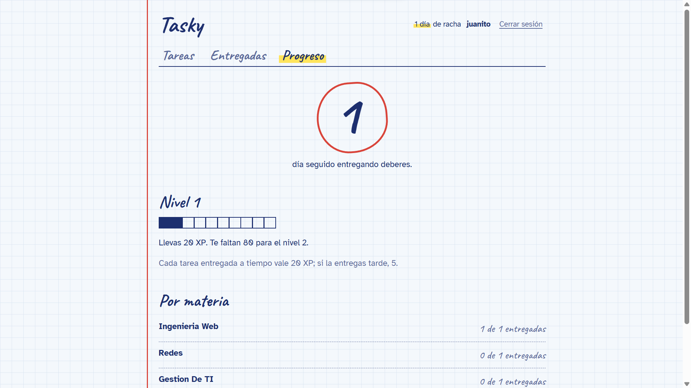
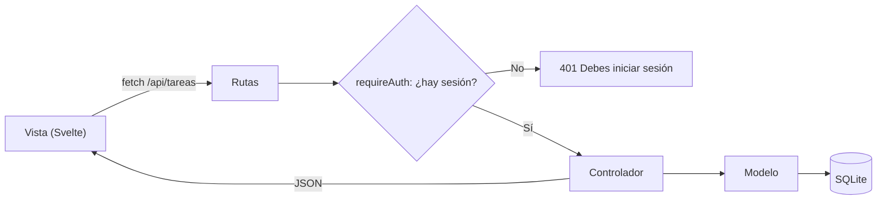

# Tasky


Aplicación web para organizar los deberes de la universidad que premia la constancia: cada tarea entregada suma XP, los días seguidos entregando forman una racha y el progreso se ve en niveles. Su diseño imita un cuaderno cuadriculado.

Proyecto de la materia **Ingeniería Web (ISWZ3101)** de la carrera de Ingeniería de Software, Universidad de Las Américas (UDLA). Implementa el patrón **MVC**, operaciones **CRUD** y un sistema de **autenticación** con rutas protegidas.



## Índice

- [Estado del proyecto](#estado-del-proyecto)
- [Funcionalidades](#funcionalidades)
- [Demostración](#demostración)
- [Arquitectura MVC](#arquitectura-mvc)
- [Instalación y ejecución](#instalación-y-ejecución)
- [Seguridad](#seguridad)
- [Endpoints de la API](#endpoints-de-la-api)
- [Tecnologías](#tecnologías)
- [Autor](#autor)

## Estado del proyecto

Terminado. Prototipo funcional entregado como primer deber del curso.

## Funcionalidades

- **Registro e inicio de sesión** con usuario y contraseña. Las contraseñas se guardan como hash MD5.
- **Rutas protegidas**: sin sesión no se puede acceder a la sección de tareas ni a la API.
- **CRUD de tareas**: crear, listar, editar y borrar deberes con materia, título, fecha de entrega y prioridad.
- **Cada usuario ve solo sus tareas**: todas las consultas filtran por el usuario de la sesión.
- **Marcar como entregada**: +20 XP si se entrega a tiempo y +5 si se entrega tarde.
- **Racha** de días seguidos entregando, **niveles** cada 100 XP y resumen **por materia**.
- **Pestañas**: Tareas, Entregadas y Progreso.
- **Modo claro y oscuro** automático según la configuración del sistema.
- **Diseño adaptable** a celulares.

## Demostración

🎬 **Video:** [Ver demostración](ENLACE_DEL_VIDEO)

| Inicio de sesión | Tareas entregadas | Progreso |
|---|---|---|
|  |  |  |
## Arquitectura MVC

| Capa | Dónde está | Responsabilidad |
|---|---|---|
| **Modelo** | `Backend/src/models/` | Acceso a la base de datos. Es el único lugar con SQL. |
| **Vista** | `Frontend/` (Svelte) | Interfaz que ve el usuario. Consume la API con `fetch`. |
| **Controlador** | `Backend/src/controllers/` | Recibe la petición, valida los datos, llama al modelo y responde en JSON. |
| Rutas | `Backend/src/routes/` | Conectan cada URL y método HTTP con su controlador. |
| Middleware | `Backend/src/middleware/` | `requireAuth` bloquea las peticiones sin sesión. |

Recorrido de una petición:



Estructura de carpetas:

```
Tasky/
├── Backend/
│   ├── scripts/cambiar-password.js   # herramienta para restablecer contraseñas
│   └── src/
│       ├── config/db.js              # conexión y creación de tablas
│       ├── models/                   # tareaModel.js, usuarioModel.js
│       ├── controllers/              # tareaController.js, authController.js
│       ├── routes/                   # tareaRoutes.js, authRoutes.js
│       ├── middleware/requireAuth.js # protege las rutas privadas
│       ├── utils/hash.js             # función MD5
│       └── server.js                 # punto de entrada
└── Frontend/
    └── src/
        ├── lib/                      # api.js, estado de sesión y tareas, cálculos de XP
        ├── components/               # Encabezado, TareaItem
        ├── pages/                    # Login, Registro, Tareas, Entregadas, Progreso
        └── App.svelte                # rutas y guardia de navegación
```

## Instalación y ejecución

### Requisitos

- [Node.js](https://nodejs.org/) **24 o superior** (incluye SQLite integrado y la opción `--env-file`).
- [Git](https://git-scm.com/).

### Pasos

1. Clona el repositorio:

```bash
   git clone https://github.com/[tu-usuario]/tasky.git
   cd tasky
```

2. Configura e inicia el **backend**:

```bash
   cd Backend
   npm install
   copy .env.example .env
   npm run dev
```

   En macOS o Linux usa `cp .env.example .env`. Luego abre `.env` y escribe una frase secreta en `SESSION_SECRET`.
   El backend queda en `http://localhost:3000` y crea la base de datos `tasky.db` automáticamente.

3. En **otra terminal**, inicia el **frontend**:

```bash
   cd Frontend
   npm install
   npm run dev
```

4. Abre **http://localhost:5173** en el navegador.

### Usuario de prueba

| Usuario | Contraseña |
|---|---|
| `demo` | `demo123` |

También puedes crear tu propia cuenta desde **Crear cuenta**.

### Restablecer una contraseña

Las contraseñas no se pueden recuperar porque solo se guarda su hash. Para asignar una nueva, desde la carpeta `Backend`:

```bash
node scripts/cambiar-password.js <usuario> <contraseña-nueva>
```

## Seguridad

- **Contraseñas con hash MD5**: nunca se guarda la contraseña real. En el login se calcula el MD5 de lo que escribe el usuario y se compara con el guardado.
- **Sesiones con cookie** `httpOnly` firmada con un secreto que vive en `.env` y no se sube al repositorio.
- **Protección en el backend**: el middleware `requireAuth` responde `401` a cualquier petición sin sesión. La redirección al login en el frontend es solo una ayuda visual; la protección real está en el servidor.
- **Aislamiento entre usuarios**: todas las consultas filtran por el `usuario_id` de la sesión.
- **Consultas parametrizadas** (`?`) para evitar inyección SQL.
- **Validaciones** de datos en el backend, con mensajes de error claros.

> **Nota sobre MD5:** se usa porque así lo pide el enunciado del deber. MD5 es rápido y no usa sal, por lo que contraseñas simples pueden descubrirse con tablas precalculadas. En un sistema real se usaría un algoritmo diseñado para contraseñas, como **bcrypt** o **Argon2**.

## Endpoints de la API

| Método | Ruta | Descripción | Requiere sesión |
|---|---|---|---|
| POST | `/api/auth/registro` | Crea una cuenta e inicia sesión | No |
| POST | `/api/auth/login` | Inicia sesión | No |
| POST | `/api/auth/logout` | Cierra sesión | No |
| GET | `/api/auth/me` | Devuelve el usuario de la sesión | No |
| GET | `/api/tareas` | Lista las tareas del usuario | **Sí** |
| POST | `/api/tareas` | Crea una tarea | **Sí** |
| PUT | `/api/tareas/:id` | Edita una tarea o cambia su estado | **Sí** |
| DELETE | `/api/tareas/:id` | Borra una tarea | **Sí** |

## Tecnologías

- **Backend:** Node.js 24, Express 5, express-session, SQLite (`node:sqlite`), `node:crypto` (MD5).
- **Frontend:** Svelte 5 (runes), Vite.
- **Herramientas:** Git, GitHub, Visual Studio Code, Thunder Client.

## Autor

**[Sebastian Parra]** — Estudiante de Ingeniería de Software, UDLA.
GitHub: [@[SebastianPG170]](https://github.com/[SebastianPG170])

Proyecto académico con fines educativos.